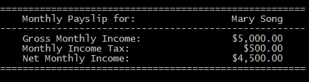

# MonthlyPay

A sample solution for a programming challenge from MYOB.

The challenge was to create a console application that will receive two inputs: an employee's name and annual salary. The solution must output a monthly payslip that shows: the employee name, monthly gross income, monthly income tax, and monthly net income. The calculation of tax is based on a tiering system where a particular tier of the annual income is taxed a particular rate.

### Design Decisions

- Despite the seemingly simple scenario, I have decided to create tiers in the app. Usual production-ready systems are similarly created to allow to expansion and decoupling of different layers of the app (e.g. data store, business logic, presentation). I have also created a DomainModels library that contains plain interfaces of the domain models. These models can also be represented as POCOs (plain old classes) instead of interfaces.
- To simplify the solution, the data store uses hard-coded data for determining income tax tiers and relevant tier rates. As such, there was no need to test the data store layer of the app since there are no 'other' scenarios/behaviour.
- All test projects are on the same folder location as the deployable code. But these can easily be moved so there is seggregation of test code from production code, if that is a convention the team would like to adopt.

### File Organisation

- The root directory contains the solution files and all project directories
- The main project is `MonthlyPay.ConsoleUI`.

### Build the App

To build the main project `MonthlyPay.ConsoleUI`

On Visual Studio, press F6.
*or*
Using the dotnet CLI:
- From the root directory of the repo, do `cd MonthlyPay.ConsoleUI`.
- Then run: `dotnet build`

### Run the App

You can use Visual Studio's Debug Run (ie, pressing F5) to run the app with configured arguments. The arguments are defined in the `Properties/launchSettings.json`
*or*
Using the dotnet CLI:
- From the root directory of the repo, do `cd MonthlyPay.ConsoleUI`.
- Then run with the arguments `Mary Song` as employee name and `60000` as annual income, run command: 
```
dotnet run -- "Mary Song" 60000`
```
## Screenshot


